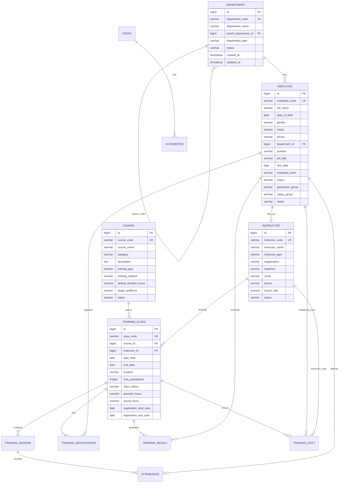

# ERD

Sơ đồ trên mô tả logical ERD mục tiêu cho toàn bộ hệ thống TMS. Tới Phase 2, MySQL runtime đã có các bảng `users`, `authorities`, `audit_log`, `department`, `employee`, `instructor`, `course`. Các bảng nghiệp vụ như `training_class`, `training_session`, `training_registration`, `attendance`, `training_result`, `training_cost` là thiết kế mục tiêu cho các phase sau.

Mô hình đầy đủ được giải thích thêm trong `data_dictionary.md` và `table_relationship.md`.
